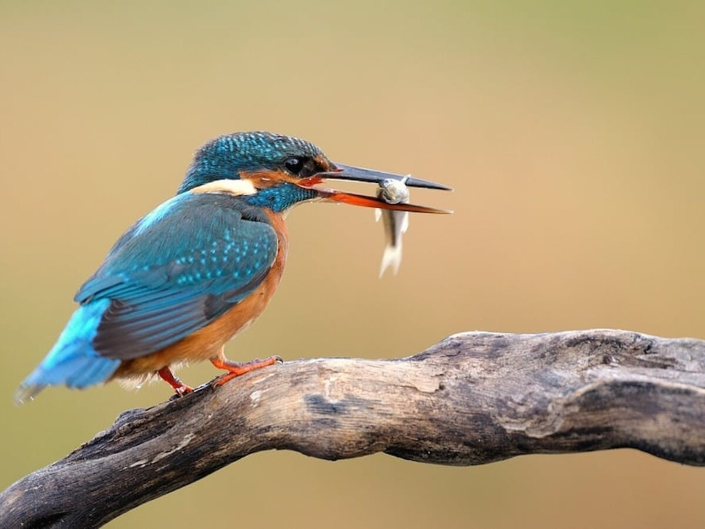

<h1 align="center">Final project: Spatial Analytics</h1>

&nbsp;
&nbsp;

<p align="center"> </a> 

&nbsp;
&nbsp;

<h2 align="center">
Kingfisher birds and water quality in Danish lakes
    </h2>

<p align="center">
    By Sofía Navarro and Astrid Sletten Rybner
    <br />

## Repository structure

This repository includes the files related to our final project in Spatial Analytics. The repository has the following folder-structure:

| Folder | Description|
|--------|:-----------|
```src``` | project folder holding main scripts
```data```| data folder
```/data_birds```| extracted data of kingfisher observations
```/data_water```| water quality data
```/data_preprocessed```| preprocessed data sets
```output``` | output plots and interactive map
```readme_images``` | images used in readme


## Technicalities

To run the scripts for the projects of this repository I recommend cloning this repository by running the following line in bash:

```
$ git clone https://github.com/AstridSlet/spatial_exam.git
```
### Usage

When you have cloned the repository you should create an R project (.rproj file) and place it at the top level folder containing the subfolders ``` data```, ```src``` and ```output```.
&nbsp;

Subsequently, you need to install the package manager **pacman** by running the first cell in **preprocessing.rmd**. When this package is installed, the packages needed for each of the three scripts are installed using **pacman**, when running the first cell in the scripts.  

The pre-processing script will produce two preprocessed data sets: one with the data on water quality and one with the data containing the kingfisher observations. The pre-processed data sets are placed in the folder ```data_preprocessed```. The analysis script will produce four plots placed in the ``` output```  folder and similarily, the mapmaking script produces its plot to this folder. 
&nbsp;


## Acknowledgements
The datasets are provided by courtesy of:
[The Danish Ornithological Association (DOA)](https://dofbasen.dk/)
[The Danish state’s environmental protection organization](https://mst.dk/service/miljoegis/hent-data/)


## Contact details
If you experience any issues with downloading the packages and installing dependencies feel free to contact us by e-mail: Sofía: au608644@uni.au.dk / Astrid: au611689@uni.au.dk
